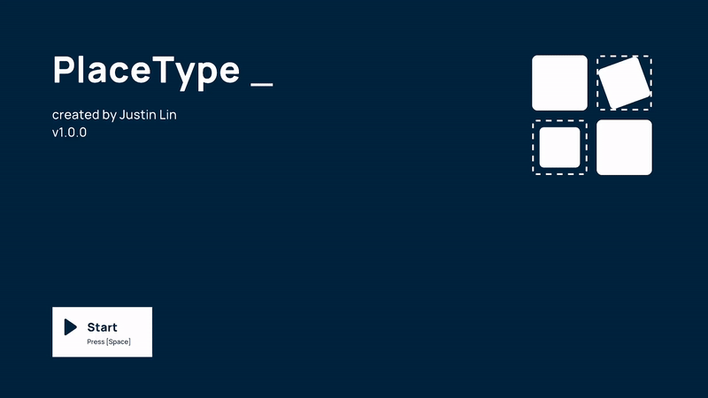
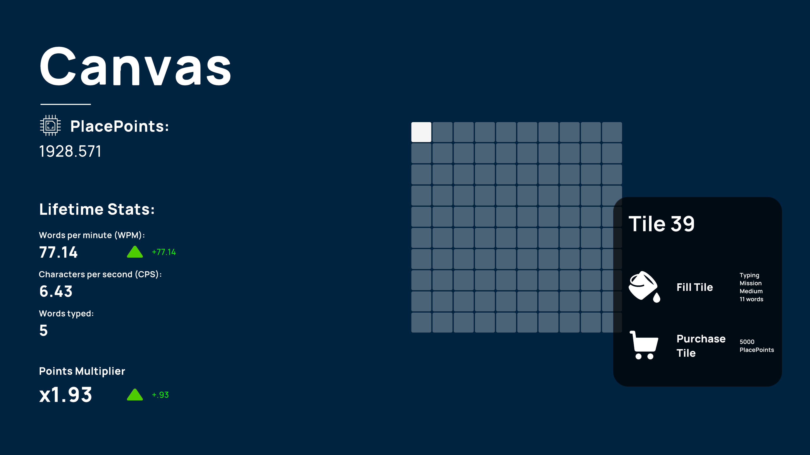
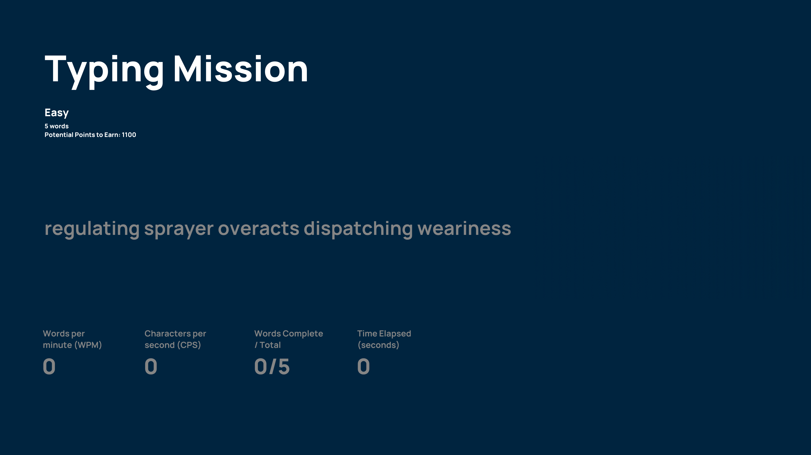
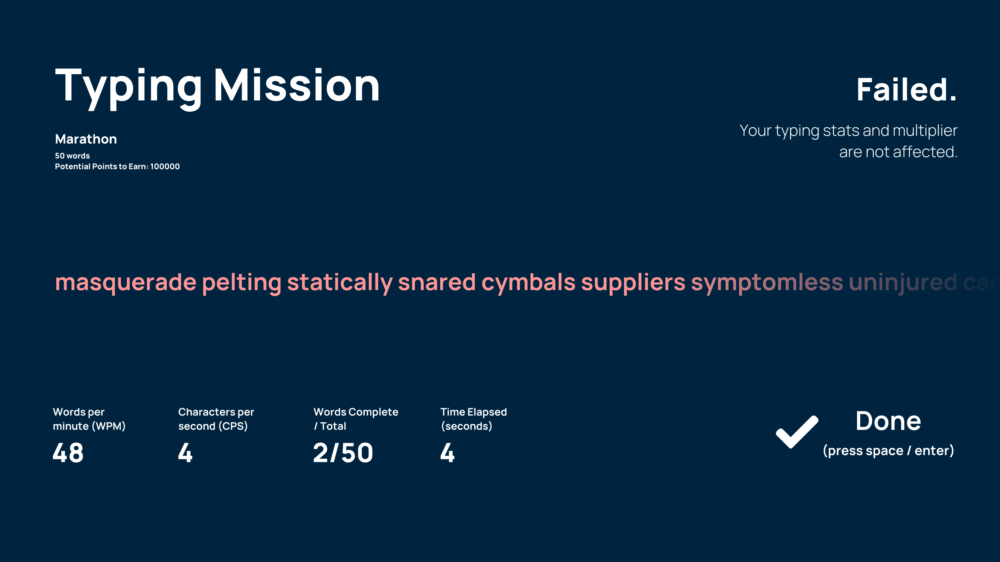
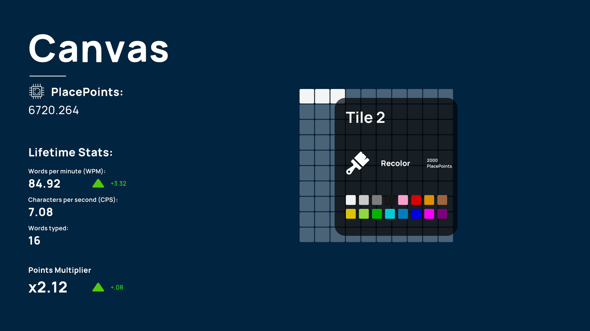
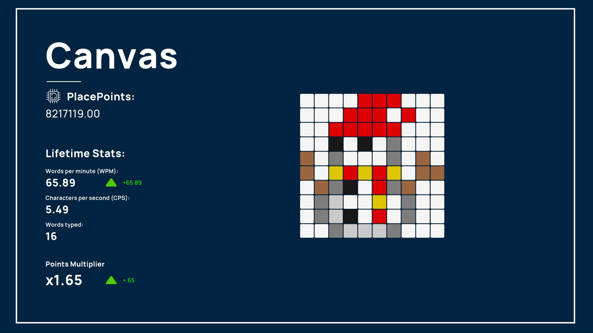

### A typing and art game by Justin Lin!

*PlaceType* is a 2D game built in Unity. Develop your typing accuracy and speed while creating imaginative pixel art! PlaceType provides a chill and satisfying environment for players to type away while working towards their next masterpiece.

If you simply want to download and play the game without tinkering with the source code, visit our [Itch.io Page](https://justinlin905.itch.io/placetype)! There, you can download and play the game on Windows for free.

To open and edit the project, devs need an installation of Unity `2020.3`. On this GitHub page, choose "Download Zip" and extract the folder. Launch Unity Hub and choose "Open", selecting the `PlaceType Source Files` folder. The project will then launch.

## Gameplay

When players start the game, they are greeted with the *Canvas*: a 10 x 10 grid of initially clear squares. On the left, players can also see their typing stats.

Players can click on each individual tile to view the two different ways to fill it: via a Typing Mission or Purchase. Typing Missions earn points but pose a challenge. Purchasing a tile spends points but unlocks the tile instantly.

Typing Missions vary in length depending on which tile is selected. The further down and to the right the tile is, the more difficult the Typing Missions get. Players will need to improve their typing accuracy or cough up more points in order to fill the deeper tiles.

Players successfully complete a Typing Mission by typing in every word without making a mistake. If the player types in an incorrect character or misses a space, the mission fails. However, players can quickly retry the mission by pressing R when prompted. Failing a mission does not negatively impact typing stats in any way.

By raising their average typing speed, players can build a multiplier which increases their earnings. Use your points to recolour tiles and create fun art!

### Notes for Developers

- TextMeshPro is used for many text objects in the game. After opening the project in Unity, make sure to import `TMP Essential Resources` by going to Window > TextMeshPro.
- In many scripts, variables relating to "region" are used to store the difficulty of a tile, ranging from Easy to Extremely Hard.
- The code for toggling helper coordinate axes is found in `ExitGameAndMenu.cs`, along with all other code related to exiting the game.

## Attributions

Please note that the list of English words used to randomly generate typing missions is sourced from [The Corncob List](http://www.mieliestronk.com/wordlist.html). I've done my best to try and remove all unsightly/offensive words from the list, but it is over 58,000 words long! If you see any of these words while playing, please help me out by making a pull request to change the `wordsList.txt` file in PlaceType Source Files > Assets > Scripts. I'll make sure to update the public Itch.io version too.

*The following are links to images and icons used in the UI of PlaceType.*

<a href="https://www.flaticon.com/free-icons/refresh" title="refresh icons">Refresh icons created by ghufronagustian - Flaticon</a>

<a href="https://www.flaticon.com/free-icons/next" title="next icons">Next icons created by Roundicons - Flaticon</a>

<a href="https://www.flaticon.com/free-icons/cpu" title="cpu icons">Cpu icons created by Freepik - Flaticon</a>

<a href="https://www.flaticon.com/free-icons/shopping-cart" title="shopping cart icons">Shopping cart icons created by Kiranshastry - Flaticon</a>

<a href="https://www.flaticon.com/free-icons/right" title="right icons">Right icons created by Pixel perfect - Flaticon</a>

<a href="https://www.flaticon.com/free-icons/bucket" title="bucket icons">Bucket icons created by Those Icons - Flaticon</a>

<a href="https://www.flaticon.com/free-icons/paint" title="paint icons">Paint icons created by Freepik - Flaticon</a>

<a href="https://www.flaticon.com/free-icons/play" title="play icons">Play icons created by Freepik - Flaticon</a>

<a href="https://www.flaticon.com/free-icons/close" title="close icons">Close icons created by ariefstudio - Flaticon</a>
